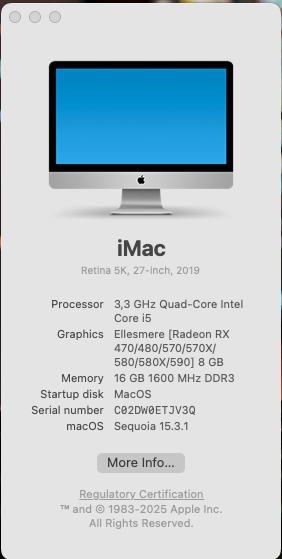
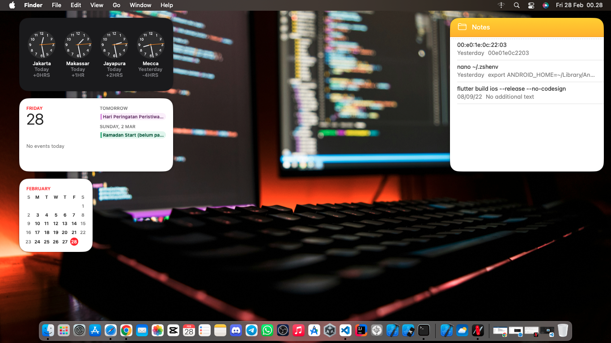

# Sequoia-Hackintosh-Haswell-EFI
Sequoia-Hackintosh-Haswell-EFI adalah repository yang berisi konfigurasi EFI untuk menjalankan macOS Sequoia pada sistem berbasis Intel Haswell dengan motherboard Amptron H81G. Repository ini dirancang untuk memberikan pengalaman macOS yang stabil dan optimal dengan hardware berikut:

| Komponen         | Spesifikasi                                                                 |
|------------------|-----------------------------------------------------------------------------|
| Prosesor         | Intel Core i5 3,3 GHz (Quad-Core, Haswell)                                  |
| Grafis           | Ellesmere [Radeon RX 470/480/570/570X/580/580X/590] 8 GB                    |
| RAM              | 6 GB 1600 MHz DDR3                                                          |
| Motherboard      | Amptron H81G                                                                |
| Penyimpanan      | NVMe 512GB                                                                  |

### Screenshot

### Fitur Utama

| Fitur                | Deskripsi                                                                 | Status |
|----------------------|--------------------------------------------------------------------------|--------|
| Bootloader           | OpenCore dengan konfigurasi terbaru untuk Haswell                        | ✅     |
| Grafis OOB           | Mendukung GPU Radeon RX 470/480/570/570X/580/580X/590 tanpa patch tambahan | ✅     |
| Penyimpanan NVMe     | Kompatibel dengan SSD NVMe untuk kinerja maksimal                         | ✅     |
| Sleep & Wake         | Konfigurasi power management yang optimal                                 | ✅     |
| Audio                | Dukungan penuh untuk chipset audio yang digunakan pada motherboard H81G   | ✅     |
| USB Mapping          | Port USB sudah dipetakan untuk kompatibilitas penuh                       | ✅     |
| Jaringan             | Dukungan LAN 10/100 Mbps                                                  | ✅     |

### Kompatibilitas macOS
| Versi macOS       | Status  |
|-------------------|---------|
| macOS Sequoia (13.x) | 🟢 Optimal |
| macOS Ventura (13.x) | 🟡 Stabil  |
| macOS Monterey (12.x) | 🟡 Stabil  |

### Cara Penggunaan
Unduh repository ini dan ekstrak folder EFI.
Copy folder EFI ke partisi EFI pada USB bootable macOS.
Pastikan melakukan konfigurasi SMBIOS sesuai dengan kebutuhan.
Boot menggunakan OpenCore dan install macOS Sequoia.
Repository ini akan diperbarui secara berkala untuk meningkatkan kompatibilitas dan stabilitas sistem. Jika mengalami kendala, silakan ajukan issue atau lakukan pull request untuk berkontribusi. 🚀
